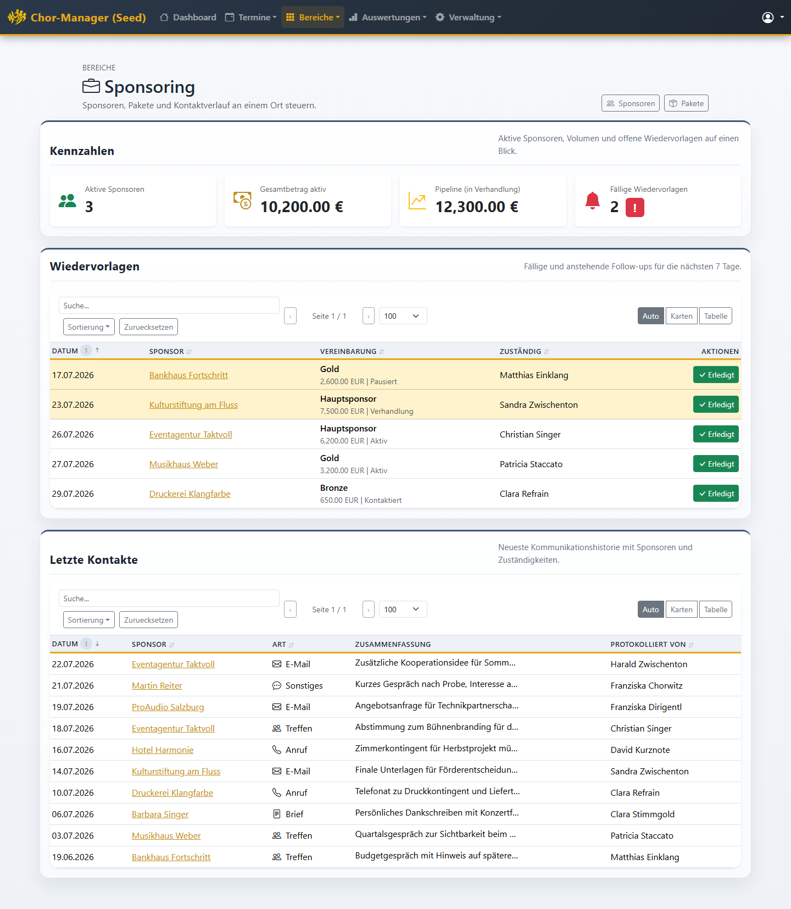

# Sponsoring

Das Sponsoring-Modul hilft dir, den Überblick über Sponsoren, Sponsoring-Pakete und Vereinbarungen zu behalten. Statt Excel-Listen und E-Mail-Verlauf findest du hier an einem Ort:

- welche Sponsoren es gibt und in welchem Status sie sind (Interessent, in Verhandlung, aktiv, ...)
- welche Vereinbarungen (Beträge, Zeiträume, Pakete) mit wem bestehen
- den Kontaktverlauf (Anrufe, E-Mails, Treffen, Briefe) mit jedem Sponsor
- fällige Wiedervorlagen, damit kein Sponsor "vergessen" wird

> **Berechtigung:** Das Sponsoring-Modul ist nur sichtbar, wenn deine Rolle das Recht **"Sponsoring verwalten"** hat. Siehst du den Menüpunkt "Sponsoring" nicht, frag den Administrator, ob dieses Recht bei deiner Rolle unter **Verwaltung → Rollen** aktiviert ist.

## Einstieg: das Dashboard

Klicke oben in der Navigation auf **Bereiche → Sponsoring**. Du landest auf dem Sponsoring-Dashboard.

Das Dashboard zeigt dir:

- **Kennzahlen**: Anzahl aktiver Sponsoren, aktueller Gesamtbetrag, Pipeline-Volumen (Vereinbarungen in Verhandlung) und Anzahl fälliger Wiedervorlagen.
- **Wiedervorlagen**: Kontakte mit einem fälligen Erinnerungstermin in den nächsten 7 Tagen. Überfällige Einträge sind gelb markiert. Mit **Erledigt** markierst du eine Wiedervorlage als abgeschlossen.
- **Letzte Kontakte**: die neueste Kommunikationshistorie mit allen Sponsoren.

## Anleitungen

- [Sponsoren verwalten](sponsoring-sponsoren) – Sponsoren anlegen, Stammdaten pflegen, Vereinbarungen anlegen, Kontakte protokollieren
- [Sponsoring-Pakete verwalten](sponsoring-pakete) – Pakete wie Bronze, Silber, Gold oder Hauptsponsor anlegen und pflegen
